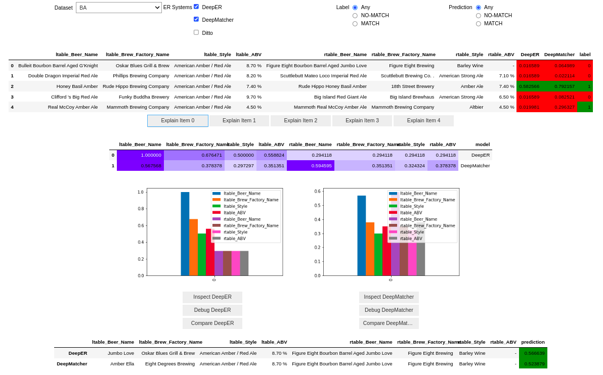

# CERTEM
Explanation system for Entity Resolution based on CERTA framework.

# Instructions

In order to run *CERTEM* within a _Jupyter Notebook_ you just need to import ``certem.system`` and then run `display(system.ui)`.

*CERTEM UI*


# Citing CERTEM

If you extend or use this work, please consider citing the following papers:

[CERTEM](https://www.vldb.org/pvldb/vol15/p3642-teofili.pdf)
```
@article{teofili2022certem,
  title={CERTEM: Explaining and Debugging Black-box Entity Resolution Systems with CERTA},
  author={Teofili, Tommaso and Firmani, Donatella and Koudas, Nick and Merialdo, Paolo and Srivastava, Divesh},
  journal={VLDB},
  year={2022}
}
```

CERTA [paper](https://arxiv.org/abs/2203.12978) and [code](https://github.com/tteofili/certa)
```
@article{teofili2022effective,
  title={Effective Explanations for Entity Resolution Models},
  author={Teofili, Tommaso and Firmani, Donatella and Koudas, Nick and Martello, Vincenzo and Merialdo, Paolo and Srivastava, Divesh},
  journal={arXiv preprint arXiv:2203.12978},
  year={2022}
}
```

